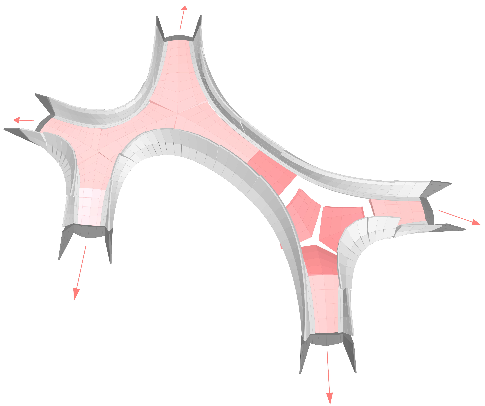

# Discrete Element Method

Discrete Element Modelling (DEM) is a method able to analyse structures composed of multiple bodies. The motion of the blocks in the DEM method is described by Newton’s second law and solved numerically by the central difference method with respect to a scalar parameter (e.g. time). The position of the blocks during the calculation is updated step by step. Two different kinds of analyses are possible, static and dynamic, and both solved with explicit numerical algorithms. In DEM, the blocks can be considered rigid or deformable, and Mohr-Coulomb failure criteria can be used to model the joints. Moreover, the blocks can move and deform independently with respect to each other; they can get completely separate, and they can form new contacts with other blocks during the analysis. Since the blocks can be considered rigid and the contact interfaces with no tensile strength, this method is suitable for the investigation of the behaviour of unreinforced masonry structures.
